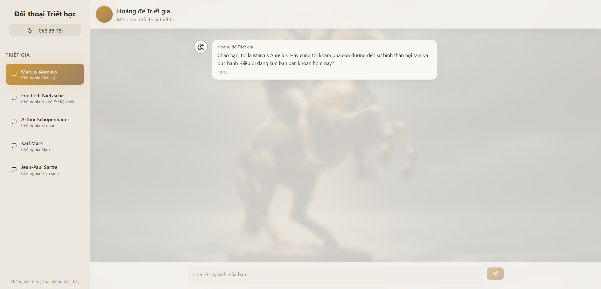

# Chatbot Triết học RAG (Retrieval-Augmented Generation)

Đây là một dự án chatbot triết học, cho phép người dùng trò chuyện với các nhà triết học vĩ đại. Chatbot được xây dựng dựa trên kiến trúc RAG, sử dụng các tài liệu bên ngoài (PDF, DOCX) làm cơ sở kiến thức, đảm bảo câu trả lời sâu sắc và chính xác.

Một điểm đặc biệt của dự án là toàn bộ quá trình xử lý và vector hóa văn bản (tạo embeddings) được thực hiện **hoàn toàn local** trên máy người dùng, không phụ thuộc vào các API embedding của bên thứ ba, giúp đảm bảo quyền riêng tư và giảm chi phí.



---

### ✨ Các tính năng nổi bật

*   **Retrieval-Augmented Generation (RAG):** Chatbot trả lời dựa trên kiến thức từ các tài liệu được cung cấp, giúp giảm thiểu "ảo giác" (hallucination) của AI.
*   **Local Embeddings:** Sử dụng `@xenova/transformers` để chạy model embedding `Xenova/all-MiniLM-L6-v2` ngay trên máy (Anh + Việt), không cần gọi API ngoài.
*   **Kiến trúc Client-Server:** Tách biệt giao diện (React) và logic xử lý (Node.js/Express) để tối ưu hiệu năng và bảo mật.
*   **Streaming Responses:** Câu trả lời của chatbot được hiển thị dần dần (hiệu ứng gõ chữ), mang lại trải nghiệm người dùng tự nhiên và mượt mà.
*   **Cơ sở dữ liệu Vector bền vững:** Sử dụng ChromaDB chạy trên Docker với Docker Volumes để lưu trữ dữ liệu vector lâu dài.
*   **Cập nhật kiến thức tăng cường:** Script thông minh cho phép nạp thêm tài liệu mới mà không cần xử lý lại toàn bộ dữ liệu cũ.

### 🛠️ Công nghệ sử dụng

*   **Frontend:** React, Vite, TypeScript, TailwindCSS
*   **Backend:** Node.js, Express.js
*   **AI & RAG:**
    *   **LLM:** Google Gemini API (`gemini-2.5-pro`)
    *   **Local Embeddings:** `@xenova/transformers`
    *   **Vector Database:** ChromaDB
*   **Môi trường:** Docker

### 🏛️ Sơ đồ kiến trúc

```
+----------------+      (1) Gửi câu hỏi      +-----------------+      (3) Vector hóa, tìm kiếm      +----------------+
|                | ------------------------> |                 | --------------------------------> |                |
|  React (Client)  |                           |  Node.js (Server) |                                   |  ChromaDB (DB) |
|                | <------------------------ |                 | <-------------------------------- |                |
+----------------+   (7) Stream câu trả lời   +-----------------+     (4) Lấy context           +----------------+
                                                      |
                                                      | (5) Gửi prompt bổ sung
                                                      v
                                              +----------------+
                                              |                |
                                              | Google Gemini  |
                                              |      API       |
                                              |                |
                                              +----------------+
                                                      ^
                                                      | (6) Stream câu trả lời về
                                                      |
```

---

### 🚀 Bắt đầu

Để chạy dự án này trên máy của bạn, hãy làm theo các bước sau.

#### 1. Yêu cầu tiên quyết

*   [Node.js](https://nodejs.org/) (phiên bản v18 trở lên)
*   [npm](https://www.npmjs.com/) (thường đi kèm với Node.js)
*   [Docker Desktop](https://www.docker.com/products/docker-desktop/)

#### 2. Cài đặt

1.  **Clone repository:**
    ```bash
    git clone https://github.com/LeMinhHung2801AI/philosophical-visions.git
    cd philosophical-visions
    ```

2.  **Cài đặt các gói phụ thuộc:**
    ```bash
    npm install
    ```

3.  **Thiết lập biến môi trường:**
    *   Sao chép file `.env.example` thành một file mới tên là `.env.local`.
        ```bash
        cp .env.example .env.local
        ```
    *   Mở file `.env.local` và thay thế `"YOUR_API_KEY_HERE"` bằng Google Gemini API key của bạn.

4.  **Chuẩn bị tài liệu kiến thức:**
    *   Tạo một thư mục tên là `documents` ở gốc dự án.
    *   Sao chép các file `.pdf` và `.docx` chứa kiến thức bạn muốn chatbot học vào thư mục `documents` này.

#### 3. Chạy ứng dụng

Để hệ thống hoạt động đầy đủ, bạn cần chạy **4 tiến trình** trong **4 cửa sổ terminal riêng biệt**.

**Terminal 1: Khởi động Database Vector (ChromaDB)**
Lệnh này sẽ khởi động container Docker và tạo một thư mục `chroma-data` để lưu trữ dữ liệu lâu dài.
```bash
docker run -p 8000:8000 -v ./chroma-data:/data chromadb/chroma
```

**Terminal 2: Nạp dữ liệu vào Database (Chỉ chạy khi cần)**
Chạy script này để đọc tài liệu, vector hóa và lưu vào ChromaDB.
*   **Chạy lần đầu tiên** để nạp dữ liệu ban đầu.
*   **Chạy lại mỗi khi bạn thêm file mới** vào thư mục `documents`.
```bash
npx ts-node --project tsconfig.cjs.json scripts/ingest.cts
```

**Terminal 3: Khởi động Backend Server**
Server này sẽ xử lý logic RAG và giao tiếp với Gemini API.
```bash
npx ts-node --project tsconfig.cjs.json server.cts
```
Bạn sẽ thấy thông báo `Backend server is running at http://localhost:3001`.

**Terminal 4: Khởi động Frontend App**
Đây là giao diện người dùng React.
```bash
npm run dev
```
Mở trình duyệt và truy cập vào URL mà Vite cung cấp (thường là `http://localhost:8080` hoặc `http://localhost:5173`).

Bây giờ bạn đã có thể bắt đầu cuộc đối thoại triết học của mình!